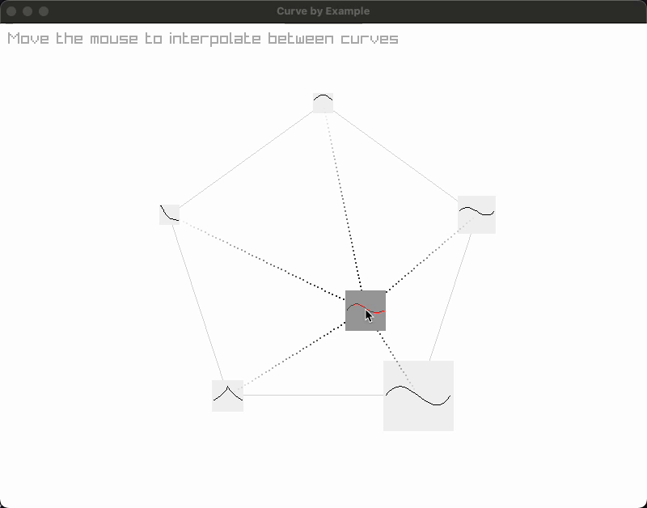

# Curve by Example

This project is a simple demonstration inspired by the "Shape by Example" Sloan, Peter-Pike J., Charles F. Rose III, and Michael F. Cohen. "Shape by example." Proceedings of the 2001 symposium on Interactive 3D graphics. 2001.

It is implemented using Rust and Raylib. It showcases interpolation between cubic Bézier curves.

## Overview

The demo presents five reference curves arranged in a pentagon. As you move the mouse within this polygon (pentagon in our case):



(well ideally we would have a database and a query mechanism, but now we just assume we have 5 examples)

- The position determines weights for each reference curve.
- An interpolated curve (in red) is generated based on these weights.

This visualization provides an intuitive understanding of how different curve shapes can be blended smoothly based on spatial positioning.

## Running the Demo

```
cargo run
```
